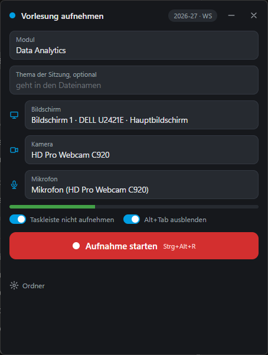
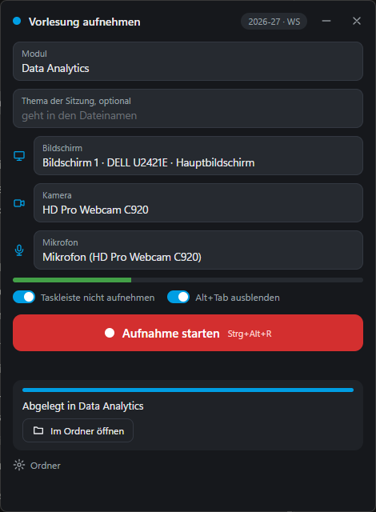
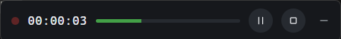
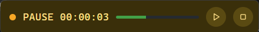
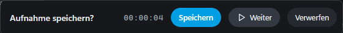

# Lecture Recorder

A small Windows app for recording lectures locally with OBS Studio, built as a replacement for recording through Microsoft Teams. It records screen, webcam and microphone in one go and afterwards files two synchronized MP4 videos (screen and camera) into a folder per term and module.

OBS does the capturing and encoding in the background, while the app gives you a compact window to pick module and devices and turns into a slim bar while you are recording. The user interface is in German, because it was written for teaching at a German university; code, comments and this documentation are in English.

| Before recording | After stopping |
|---|---|
|  |  |

While recording, the window shrinks to a slim bar that turns yellow when paused and can be minimized (the hotkeys keep working), and stopping asks whether to keep the recording:







## Features

- **Screen, camera and microphone are selectable**, and the microphone level is shown live, so you notice a muted mic before the lecture starts.
- **The window itself is never recorded.** It stays visible on your screen but is excluded from capture (`SetWindowDisplayAffinity`).
- **The taskbar is left out** of the screen track by default, using the work area of the selected monitor.
- **The Alt+Tab overview is hidden.** The Windows task switcher cannot be excluded from capture, so the app logs when you press Alt+Tab and freezes the screen track for that moment afterwards, while audio and camera keep running.
- **Pause and resume** with a button or a global hotkey.
- **Save, continue or discard**: stopping first pauses the recording and asks what to do, so an accidental stop costs nothing. A discarded recording goes to the recycle bin.
- **Two MP4 files per session**, for example `2026-10-09 - Regression - Bildschirm.mp4` and `… - Kamera.mp4`, filed under `<archive>\<term>\<module>\`. Both tracks share the same audio and start at the same instant, so they can be placed side by side in an editor without syncing.
- **Configurable folders** for the archive and for the raw recordings, plus an "open in folder" button once a recording is filed.
- **Moderate load and file size**: hardware encoding on NVIDIA (NVENC) with constant quality, about 3.4 GB per hour for the raw recording. Without an NVIDIA GPU the app falls back to x264, which works on any machine but uses noticeably more CPU.
- **One file to share**: a single `lecture-recorder.exe` with ffmpeg built in. It sets up OBS on its own, including the remote control.

## Quick start (exe)

1. Install [OBS Studio](https://obsproject.com/) 28 or later, open it once and close the auto-configuration wizard.
2. Download `lecture-recorder.exe` from the [releases](https://github.com/winf-hsos/lecture-recorder/releases) and start it.

That is all. The exe starts OBS minimized to the tray, switches on OBS's remote control (obs-websocket) with a random password if it is off, and creates its own OBS profile and scene collection named `Lecture`, with a wide 3840×1200 canvas that holds the screen on the left and the webcam on the right. Existing OBS profiles are not touched. If OBS is already running with the remote control switched off, the app asks you to close OBS once so it can switch it on.

The exe is not code-signed, so on first start Windows SmartScreen may show "Windows protected your PC"; click **More info → Run anyway**. It takes a few seconds to start because it unpacks itself into a temporary folder.

## Running from source

Requirements: Windows 10 or 11, OBS Studio 28 or later, [ffmpeg](https://ffmpeg.org/) on the `PATH` (with `h264_nvenc` and `libx264`, for example a gyan.dev full build), and Python 3.10 or later.

```bash
pip install -r requirements.txt
```

```bash
python recorder.py
```

`lecture-recorder.cmd` starts it without a console window, and `python tools/setup_obs.py` checks the OBS connection and lists the devices OBS sees. The app reads the remote-control password from OBS's own configuration; the environment variable `OBS_WEBSOCKET_PASSWORD` works as a fallback. The password is never printed.

To build the exe yourself, install PyInstaller and run:

```bash
python tools/build_exe.py
```

It bundles the ffmpeg from your `PATH` and writes `dist/lecture-recorder.exe` (about 115 MB).

## Usage

1. Pick or type the module and optionally a topic for the session; both go into the file name.
2. Check screen, camera and microphone, and watch the level bar.
3. Click **Aufnahme starten** or press **Ctrl+Alt+R**. The window shrinks to a bar at the top of the screen.
4. Pause and resume with the pause button or **Ctrl+Alt+P**.
5. Stop with the stop button, or press **Ctrl+Alt+R** twice within three seconds (the double press protects against stopping a lecture with a stray keystroke). The recording is paused and the bar asks whether to save it: **Speichern** files it, **Weiter** continues recording, and **Verwerfen** (click twice) moves the raw file to the recycle bin.

After stopping, the recording is split and encoded into the two MP4 files, and the raw MKV is deleted only once both outputs have been checked to be as long as the source. If splitting fails, the raw file is kept. Closing the window during a recording keeps and files it as well.

The current term is derived from the date: winter term from 1 September to the end of February, summer term from 1 March. Folder names follow the pattern `2026-27 - WS` and `2026 - SS`. Module suggestions come from the folders that already exist for the term, and optionally from a Markdown file whose `## ` headings are module names (`module_file` in the settings).

Settings are stored in `%APPDATA%\lecture-recorder\settings.json`.

## How it works

| File | Role |
|---|---|
| `recorder.py` | Window and JavaScript bridge (pywebview with Edge WebView2), single instance, capture exclusion |
| `ui.html` | The user interface |
| `core.py` | Settings, device selection, recording state, hotkey handling, split after stopping |
| `obs_remote.py` | Minimal obs-websocket v5 client, OBS startup, switching the remote control on |
| `obs_scene.py` | OBS profile, scene, sources, encoder settings, screen crop |
| `monitors.py` | Monitor geometry and taskbar margins from Windows |
| `hotkeys.py` | Global hotkeys and a low-level keyboard hook that detects Alt+Tab |
| `hardware.py` | Finds ffmpeg and picks NVENC or x264 |
| `split.py` | ffmpeg split into screen and camera track, freezing the Alt+Tab spans; also usable on the command line |
| `tools/benchmark.py` | Test recording that measures CPU, GPU and encoder load |
| `tools/build_exe.py` | Builds the single exe with PyInstaller |

Hiding Alt+Tab needs a small correction: the time OBS reports runs about 0.55 seconds ahead of the picture that ends up in the file, so the detected spans are shifted by that delay and padded a little on both sides before they are frozen.

## Limitations

- Windows only. Without an NVIDIA GPU, recording and splitting run on the CPU (x264), which a weaker laptop may struggle with at this canvas size.
- The camera field is 1920×1080; the screen field holds up to 1920×1200.
- Streaming (for example to YouTube) is not built in yet.

## Third-party software

The exe contains [FFmpeg](https://ffmpeg.org/) (gyan.dev full build, licensed under the GPLv3; source at https://github.com/FFmpeg/FFmpeg and build details at https://www.gyan.dev/ffmpeg/builds/) and the Python runtime with pywebview, pythonnet and websockets, each under its own license.

## License

The source code is licensed under the MIT License, see [LICENSE](LICENSE). The bundled FFmpeg in the exe keeps its own license (GPLv3).
